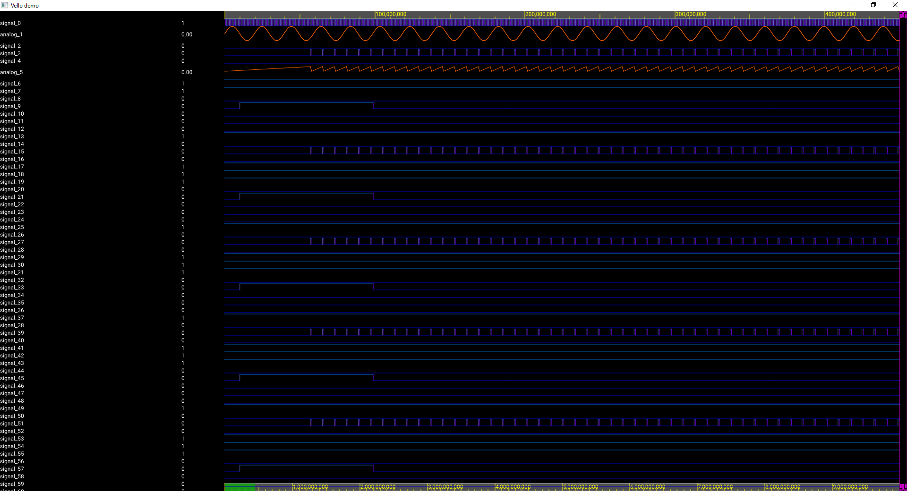

<div align="center">

# WavyGravy

**An experimental GPU compute-centric waveform display program**

</div>

WaveGravy is a high-performance waveform display program using Vello.
Vello is a 2d graphics rendering engine, using [`wgpu`].
It efficiently draws large 2d scenes with interactive or near-interactive performance.

<!-- Impressive picture here -->


Requires [](https://github.com/linebender/vello) is copied locally to the same 
directory as wavegravy.

Quickstart to run an example program:
```shell
cargo run
```

## Platforms

Based on the Vello winit example, so it probably works in Android and Web. Who knows..

## Community

Maybe try :

[](https://xi.zulipchat.com/#narrow/stream/197075-gpu)

Discussion of Vello development happens in the [Xi Zulip](https://xi.zulipchat.com/), specifically the [#gpu stream](https://xi.zulipchat.com/#narrow/stream/197075-gpu). All public content can be read without logging in

## Goals

1. Display waveforms
2. Be fast
3. Test Vello

## License

Licensed under

- MIT license
   ([LICENSE-MIT](LICENSE-MIT) or <http://opensource.org/licenses/MIT>)

## Contribution

Contributions are welcome by pull request. The [Rust code of conduct] applies.

Unless you explicitly state otherwise, any contribution intentionally submitted
for inclusion in the work by you shall be licensed as above, without any additional 
terms or conditions.

[Vello]: https://github.com/linebender/vello/
[`wgpu`]: https://wgpu.rs/
[rust code of conduct]: https://www.rust-lang.org/policies/code-of-conduct
[winit]: https://github.com/rust-windowing/winit
